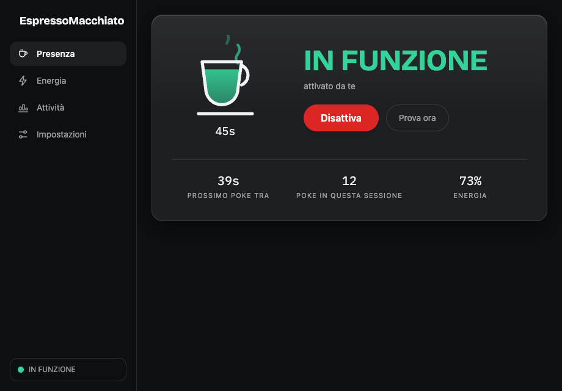

# ☕ EspressoMacchiato

**Tiene la macchina sveglia e presente — e azzera davvero il contatore di inattività del sistema, così Teams resta verde.**

[English 🇬🇧](README.md)

    [](https://github.com/simiriva95/EspressoMacchiato/actions/workflows/ci.yml)

<p align="center"></p>

## Perché esiste

La maggior parte dei keep-awake impedisce solo lo sleep. **Non basta**: i client di presenza (Microsoft Teams, Slack) leggono il **contatore di inattività** del sistema, che continua a salire anche con lo sleep inibito — dopo ~5 minuti vai in Assente comunque. EspressoMacchiato fa entrambe le cose:

| Meccanismo | Cosa ottieni |
|---|---|
| **Inibizione sleep/idle** (IOPMAssertion su macOS, D-Bus logind/ScreenSaver su Linux) | Sistema acceso, display acceso, niente blocco |
| **Attività HID sintetica** (mouse move a delta zero di default) | Il contatore di inattività si azzera → presenza verde |

L'iniezione è invisibile: il cursore non si muove, nessun tasto arriva alle tue app. La **tazza fumante** mostra il contatore in tempo reale: una tazza che si riempie di caffè mentre l'inattività sale e si svuota appena un poke la azzera, direttamente nella menu bar. La guardi funzionare invece di sperarlo.

## Funzionalità

**Keep-awake**
- Un click sulla tazza nella menu bar apre una **dashboard** completa; la tazza nel tray è **animata** — il vapore sale e il livello del caffè segue la tua inattività, colorato in base allo stato
- Attivazione dalla dashboard, hotkey globale (default `Cmd/Ctrl+Alt+E`), menu del tray o deep link `espresso://`
- Durate: senza limite, **espresso (focus 25 min)**, 15m–4h, fino a un orario, fino a fine giornata, o **fino a fine riunione** (legge il calendario)
- **Attivazione automatica in call** — rileva il microfono in uso, si spegne a fine chiamata
- Intervallo di poke configurabile (10–240 s) e strategia (mouse move a delta zero, tocco F15, spostamento 1px)
- Finestre orarie per giorno (robuste al cambio ora) e gate opzionali: sospendi a batteria (con soglia), solo con Teams/una tua app aperta, pausa a schermo bloccato; i poke si saltano da soli mentre scrivi davvero

**Energia e statistiche**
- Pannello energia: % batteria, salute, cicli, temperatura, watt, grafici interattivi 2h/4h/8h, processi più pesanti — tutto locale, niente su disco
- **Report settimanale**: ore di presenza protetta, poke, espresso completati e trend mensile di salute batteria
- Avvisi opzionali con rate limit: stacca il caricatore, batteria in riserva (col processo più pesante), surriscaldamento, timer scaduto, promemoria calibrazione mensile

**Esperienza**
- Design liquid-glass, temi con colore accento, **pillola HUD** galleggiante opzionale, anello di progresso live sull'icona
- UI bilingue (IT/EN), tema chiaro/scuro, WCAG 2.2 AA
- Comandi **Raycast** e supporto **Apple Shortcuts** tramite lo schema deep-link
- 100% locale: zero telemetria, zero account, zero chiamate di rete

## Compatibilità testata

| | keep-awake | presenza verde | pannello batteria |
|---|---|---|---|
| macOS 12+ (Apple Silicon/Intel) | ✅ verificato | ⚠️ serve il permesso Accessibilità; verifica con "Prova ora" | ✅ verificato |
| Linux X11 | ❔ implementato, non ancora verificato su hardware | ❔ | ❔ |
| Wayland GNOME | ❔ (via uinput) | ❔ | ❔ |
| Wayland KDE | ❔ (via uinput) | ❔ | ❔ |

❔ = il codice segue le interfacce documentate e builda in CI, ma nessuno ha ancora eseguito la checklist di accettazione su quel setup. I report sono benvenuti: il template delle issue chiede esattamente ciò che serve.

## Installazione

### macOS (Homebrew, Apple Silicon)

```bash
brew tap simiriva95/espressomacchiato https://github.com/simiriva95/EspressoMacchiato
brew install --cask --no-quarantine espresso-macchiato
```

`--no-quarantine` perché l'app è firmata ad-hoc, non notarizzata — la notarizzazione costa 99 $/anno e il codice è ispezionabile. Oppure a mano: scarica il `.dmg` dalle [Release](https://github.com/simiriva95/EspressoMacchiato/releases), trascina in Applicazioni, poi:

```bash
xattr -dr com.apple.quarantine /Applications/EspressoMacchiato.app
```

Poi concedi **Impostazioni di Sistema → Privacy e Sicurezza → Accessibilità** quando l'app lo chiede: senza, macOS scarta silenziosamente gli eventi sintetici, e l'app te lo dice (modalità ridotta dichiarata) invece di fingere.

### Linux

Scarica `.deb`, `.rpm` o `.AppImage` dalle [Release](https://github.com/simiriva95/EspressoMacchiato/releases). deb/rpm installano da soli la udev rule per `/dev/uinput`; poi:

```bash
sudo usermod -aG input $USER
```

e fai logout/login. Per l'AppImage installa prima la rule a mano:

```bash
sudo cp packaging/linux/99-espressomacchiato-uinput.rules /etc/udev/rules.d/ && sudo udevadm control --reload-rules && sudo udevadm trigger
```

Niente accesso a uinput? Su X11 l'app ripiega da sola su XTest. Su Wayland puro non c'è fallback — il wizard iniziale rileva e spiega la tua situazione esatta.

## Come funziona

- **Inibizione**: `IOPMAssertionCreateWithName` (sistema + display) su macOS; fd inibitore `org.freedesktop.login1` + cookie `org.freedesktop.ScreenSaver` (+ GNOME SessionManager) su Linux. Tutto viene rilasciato allo spegnimento e muore col processo — niente demoni, niente residui.
- **Azzeramento idle**: un evento `MouseMoved` a delta zero sulla posizione corrente del cursore (macOS), o un frame `REL_X 0, REL_Y 0` da un puntatore virtuale uinput (Linux). Il cursore non si muove; niente arriva all'app in foreground.
- **Verifica**: il Contatore di inattività legge la stessa fonte dei client di presenza (`CGEventSourceSecondsSinceLastEventType` / XScreenSaver / Mutter). "Prova ora" mostra il delta prima/dopo.

Note API complete: [docs/PLATFORM-NOTES.md](docs/PLATFORM-NOTES.md). Architettura: [docs/ARCHITECTURE.md](docs/ARCHITECTURE.md).

## Uso responsabile

Verifica le policy della tua organizzazione prima di usare strumenti di presenza. EspressoMacchiato non nasconde né falsifica nulla oltre l'idle time locale: non intercetta i tuoi input, non parla con Teams né con alcuna API, non tocca la rete (zero telemetria, zero account; l'unica chiamata opzionale sarebbe il check aggiornamenti, e oggi non esiste).

## Non-obiettivi

Nessun helper privilegiato, nessun demone root, nessun charge limiting hardware, nessuna app mobile, nessun account, niente Windows nella v1, nessuna registrazione o intercettazione di input reali.

## FAQ

**Teams va comunque in Assente.** Usa "Prova ora" nel Contatore. Se l'idle non si azzera: su macOS ricontrolla Accessibilità (il permesso si resetta quando il binario cambia); su Linux verifica l'accesso a `/dev/uinput` nel wizard. Se l'idle si azzera ma Teams cade lo stesso, il tuo Teams legge la presenza da altro (es. blocco del telefono) — apri una issue con i dettagli.

**Funziona a schermo bloccato?** Bloccare vanifica lo scopo (macOS fa cadere la presenza al blocco) — per questo esiste l'assertion sul display. C'è un gate opzionale per sospendere al blocco, spento di default.

**La batteria dice "non disponibile".** Quella metrica non esiste sul tuo hardware (es. desktop). È onestà, non un bug.

## Roadmap

M6: tap Homebrew + AUR. Poi: injection via libei/portal per Wayland, updater quando ci sarà una chiave di firma (vedi [docs/IDEAS.md](docs/IDEAS.md)).

## Contribuire

Vedi [CONTRIBUTING.md](CONTRIBUTING.md). I report hardware per le celle ❔ qui sopra sono il contributo più prezioso in questo momento.

## Licenza

[MIT](LICENSE)
