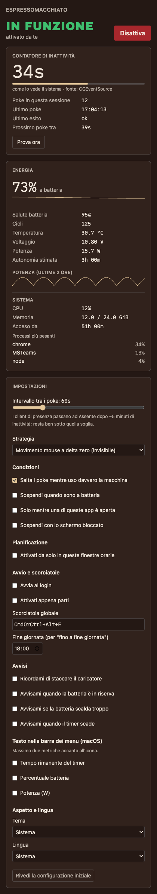

# ☕ EspressoMacchiato

**Keeps your machine awake and present — and actually resets the OS idle counter, so Teams stays green.**

[Italiano 🇮🇹](README.it.md)

    [](https://github.com/simiriva95/EspressoMacchiato/actions/workflows/ci.yml)

<p align="center"></p>

## Why this exists

Most keep-awake tools only stop the machine from sleeping. That is **not enough**: presence clients (Microsoft Teams, Slack) read the OS **idle counter**, and it keeps growing even while sleep is inhibited — after ~5 minutes you go Away anyway. EspressoMacchiato does both jobs:

| Mechanism | What it gets you |
|---|---|
| **Sleep/idle inhibition** (IOPMAssertion on macOS, logind/ScreenSaver D-Bus on Linux) | System stays on, display stays on, no lock |
| **Synthetic HID activity** (zero-delta mouse move by default) | The idle counter resets → presence stays green |

The injection is invisible: no cursor movement, no keystrokes reaching your apps. The **Idle Monitor** panel shows the OS idle counter live — you watch it climb and snap back to zero, so you know it works instead of hoping.

## Features

- One-click (or hotkey, default `Cmd/Ctrl+Alt+E`) activation from the menu bar / tray
- Durations: indefinite, 15m–4h, until a time, until end of day
- Configurable poke interval (10–240 s) and strategy (zero-delta mouse move, F15 key tap, 1px nudge)
- Schedule windows per weekday, DST-safe
- Opt-in gates: suspend on battery (with threshold), only while Teams/your app is running, pause when the screen locks; pokes auto-skip while you're actually typing
- Energy panel: battery %, health, cycles, temperature, watts, 2-hour sparklines, top processes — all local, nothing persisted
- Opt-in alerts (unplug reminder, low battery, overheat, timer expired), rate-limited
- Bilingual UI (EN/IT), light/dark, WCAG 2.2 AA

## Tested compatibility

| | keep-awake | presence stays green | battery panel |
|---|---|---|---|
| macOS 12+ (Apple Silicon/Intel) | ✅ verified | ⚠️ needs Accessibility permission; verify with the built-in "Test now" | ✅ verified |
| Linux X11 | ❔ implemented, not yet verified on hardware | ❔ | ❔ |
| Wayland GNOME | ❔ (uinput path) | ❔ | ❔ |
| Wayland KDE | ❔ (uinput path) | ❔ | ❔ |

❔ = code follows the documented interfaces and builds in CI, but nobody has run the acceptance checklist on that setup yet. Reports welcome — the issue template asks for exactly what we need.

## Install

### macOS

Download the `.dmg` from [Releases](https://github.com/simiriva95/EspressoMacchiato/releases), drag to Applications, then:

```bash
xattr -dr com.apple.quarantine /Applications/EspressoMacchiato.app
```

Why: the app is ad-hoc signed, not notarized — notarization costs 99 $/year and the code is public and inspectable. A Homebrew tap (`brew install --cask --no-quarantine`) is planned.

Then grant **System Settings → Privacy & Security → Accessibility** when the app asks: without it macOS silently drops synthetic events, and the app will tell you it is running degraded instead of pretending.

### Linux

Download `.deb`, `.rpm` or `.AppImage` from [Releases](https://github.com/simiriva95/EspressoMacchiato/releases). The deb/rpm install the udev rule for `/dev/uinput` automatically; then:

```bash
sudo usermod -aG input $USER
```

and log out/in. For the AppImage, install the rule manually first:

```bash
sudo cp packaging/linux/99-espressomacchiato-uinput.rules /etc/udev/rules.d/ && sudo udevadm control --reload-rules && sudo udevadm trigger
```

No uinput access? On X11 the app falls back to XTest automatically. On pure Wayland there is no fallback — the onboarding wizard detects and explains your exact situation.

## How it works

- **Inhibition**: `IOPMAssertionCreateWithName` (system + display) on macOS; `org.freedesktop.login1` inhibitor fd + `org.freedesktop.ScreenSaver` cookie (+ GNOME SessionManager) on Linux. Everything is released on toggle-off and dies with the process — no daemons, no leftovers.
- **Idle reset**: a zero-delta `MouseMoved` event posted at the current cursor position (macOS), or a `REL_X 0, REL_Y 0` frame from a virtual uinput pointer (Linux). The cursor does not move; nothing reaches the foreground app.
- **Verification**: the Idle Monitor reads the same source presence clients use (`CGEventSourceSecondsSinceLastEventType` / XScreenSaver / Mutter). "Test now" shows the before/after delta.

Full API notes: [docs/PLATFORM-NOTES.md](docs/PLATFORM-NOTES.md). Architecture: [docs/ARCHITECTURE.md](docs/ARCHITECTURE.md).

## Responsible use

Check your organization's policies before using presence tools. EspressoMacchiato does not hide or fake anything beyond the local idle time: it does not intercept your input, does not talk to Teams or any API, does not touch the network (no telemetry, no accounts; the only optional outbound call would be a release check, and none ships today).

## Non-goals

No privileged helper, no root daemon, no hardware charge limiting, no mobile app, no accounts, no Windows in v1, no recording or interception of real input.

## FAQ

**Teams still goes Away.** Run "Test now" in the Idle Monitor. If idle doesn't reset: on macOS re-check Accessibility (the grant resets when the binary changes); on Linux check `/dev/uinput` access in the wizard. If idle resets but Teams still drops, your Teams reads presence from somewhere else (e.g. phone lock) — file an issue with the details.

**Does it work with the screen locked?** Locking defeats the purpose (macOS drops presence on lock) — that's why the display-sleep assertion exists. There's an optional gate to suspend on lock, off by default.

**Battery says "not available".** That metric doesn't exist on your hardware (e.g. desktop). That's honest, not broken.

## Roadmap

M6: Homebrew tap + AUR. Later: libei/portal injection for Wayland, updater once a signing key is set up (see [docs/IDEAS.md](docs/IDEAS.md)).

## Contributing

See [CONTRIBUTING.md](CONTRIBUTING.md). Hardware reports for the ❔ cells above are the most valuable contribution right now.

## License

[MIT](LICENSE)
