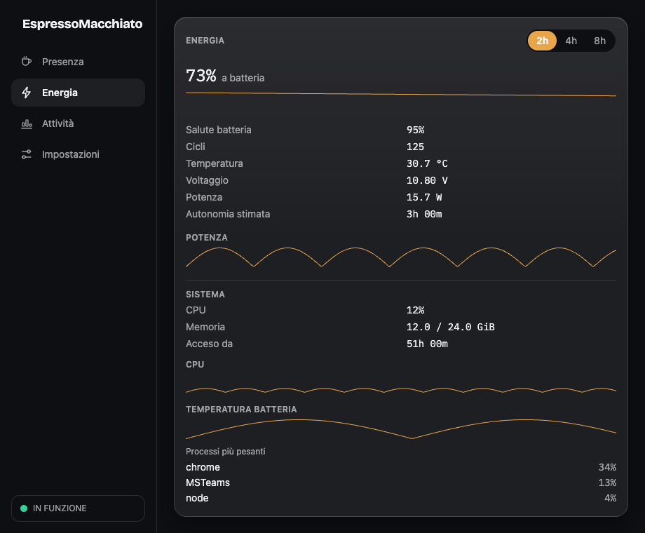
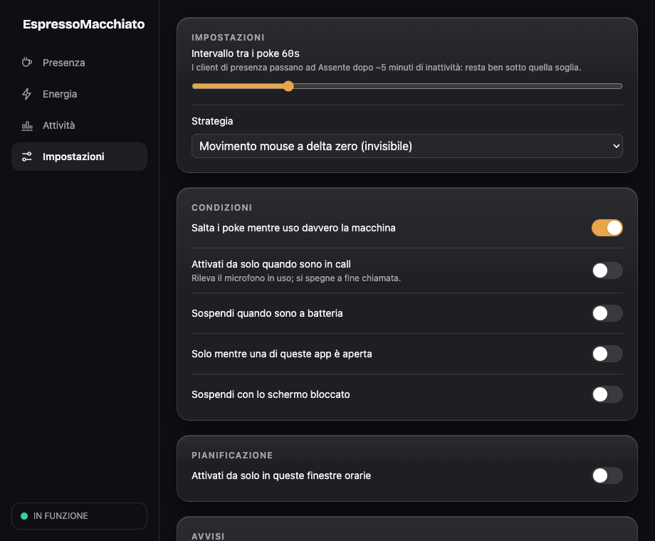

<h1 align="center">☕ EspressoMacchiato</h1>

<p align="center"><em>A menu bar / tray keep-awake for macOS and Linux that actually resets the OS idle counter — so Teams and Slack stay green.</em></p>

<p align="center">
  
  
  
  
  
  
  
</p>

<p align="center">
  <a href="https://github.com/simiriva95/EspressoMacchiato/actions/workflows/ci.yml"></a>
  ·
  <a href="README.it.md">Italiano 🇮🇹</a>
</p>

<p align="center"></p>

Most keep-awake tools only stop the machine from sleeping. That is not enough: presence clients read the **OS idle counter**, which keeps growing even while sleep is inhibited — so after a few minutes you go Away anyway. EspressoMacchiato does both jobs, and then shows you the counter it is resetting: the signature brewing cup fills as idle climbs and drains the instant a poke lands. You watch it work instead of hoping.

| Mechanism | What it gets you |
|---|---|
| **Sleep + display-sleep inhibition** — `IOPMAssertion` on macOS, logind inhibitor fd + `org.freedesktop.ScreenSaver` on Linux | The system stays on, the display stays on, no lock |
| **Synthetic HID activity** — zero-delta mouse move by default | The idle counter resets, so presence stays green |

The injection is invisible: the cursor does not move and no keystrokes reach your apps.

## Features

- **Two mechanisms, one switch** — inhibition and idle-counter resets are held together and released together; everything dies with the process, no daemons or leftovers.
- **A visible idle counter** — the tray cup and the dashboard hero both render the live OS idle value, tinted by state, with a "Test now" button that prints the before/after delta.
- **Durations that match real days** — no limit, a 25-minute **espresso shot**, 15m/30m/1h/2h/4h, until a time, until end of day, or **until your meeting ends** (macOS EventKit).
- **Auto-activate while you're in a call** — a read-only mic-in-use probe (CoreAudio on macOS, PulseAudio/PipeWire on Linux) turns protection on for the call and off when it ends.
- **Opt-in gates, never surprises** — weekday schedule windows (DST-safe), suspend on battery below a threshold, only while a named process runs, pause on screen lock; pokes auto-skip while you are actually typing.
- **Energy panel** — battery percentage, health, cycles, temperature, watts, 2h/4h/8h interactive history and top processes; anything the hardware does not expose reads "not available" instead of a fabricated zero.
- **Weekly report and rate-limited alerts** — protected-presence time, pokes and shots, a monthly battery-health trend, plus opt-in unplug / low-battery / overheat / timer-expired notifications.
- **Drive it from anywhere** — global hotkey (`CmdOrCtrl+Alt+E`), tray menu, floating HUD pill, `espresso://on|off|toggle` deep links, bundled Raycast script commands and Apple Shortcuts.
- **100% local** — no telemetry, no accounts, no network calls, no update pings. Bilingual EN/IT UI, light/dark, WCAG 2.2 AA, reduced-motion aware.

<p align="center">
  
  
</p>

<p align="center"></p>

## Tech stack

| Layer | What it uses |
|---|---|
| Shell | [Tauri 2](https://tauri.app) (`tray-icon`, `macos-private-api`), plugins: autostart, global-shortcut, deep-link, notification, single-instance, opener |
| Backend | Rust (edition 2021), Tokio, serde, thiserror/anyhow, tracing, chrono, sysinfo, directories |
| macOS FFI | `objc2` + `objc2-event-kit`, `core-graphics`, `core-foundation`, `block2` — IOPMAssertion, CGEvent, EventKit, AppleSmartBattery |
| Linux | `zbus 5` (logind / ScreenSaver / Mutter D-Bus), `evdev` (uinput), `x11rb` (XTest, XScreenSaver) |
| Frontend | React 19.1, TypeScript 5.8, Vite 7, Tailwind CSS 4, Zustand 5, i18next 26 / react-i18next 17 |
| Quality | Vitest 3 + Testing Library, an axe-core a11y test, ESLint 9 + `jsx-a11y`, `cargo fmt` / `clippy -D warnings`, an i18n-coverage test that rejects hardcoded JSX strings |

## Getting started

### Install — macOS (Apple Silicon)

```bash
brew tap simiriva95/espressomacchiato https://github.com/simiriva95/EspressoMacchiato
brew install --cask espresso-macchiato
```

The cask strips the quarantine flag for you — the app is self-signed, not notarized (notarization costs 99 $/year; the code is public and inspectable). Or download the `.dmg` from [Releases](https://github.com/simiriva95/EspressoMacchiato/releases), drag it to Applications, then:

```bash
xattr -dr com.apple.quarantine /Applications/EspressoMacchiato.app
```

Then grant **System Settings → Privacy & Security → Accessibility** when the app asks. Without it macOS silently drops synthetic events — the app tells you it is running degraded rather than pretending.

### Install — Linux

Download the `.deb`, `.rpm` or `.AppImage` from [Releases](https://github.com/simiriva95/EspressoMacchiato/releases). The deb and rpm install the `/dev/uinput` udev rule automatically; then add yourself to the `input` group and log out and back in:

```bash
sudo usermod -aG input $USER
```

For the AppImage, install the rule by hand first:

```bash
sudo cp packaging/linux/99-espressomacchiato-uinput.rules /etc/udev/rules.d/
sudo udevadm control --reload-rules && sudo udevadm trigger
```

No uinput access? On X11 the app falls back to XTest automatically. On pure Wayland there is no fallback — the onboarding wizard detects and explains your exact situation. An AUR `PKGBUILD` template lives in [`packaging/aur/`](packaging/aur/PKGBUILD.tmpl).

### Build from source

Prerequisites: Rust stable, Node 22+, and on Linux the Tauri build dependencies:

```bash
sudo apt-get install -y libwebkit2gtk-4.1-dev libayatana-appindicator3-dev \
  librsvg2-dev libxdo-dev build-essential curl wget file libssl-dev
```

```bash
npm install
npm run tauri dev          # run the app
npm run tauri build        # bundle dmg / deb / rpm / AppImage
```

The same checks CI enforces:

```bash
cd src-tauri && cargo fmt --check && cargo clippy --all-targets -- -D warnings && cargo test
npx tsc --noEmit && npm run lint && npm test
```

Platform code that touches real OS services sits behind `#[ignore]`d tests: `cd src-tauri && cargo test -- --ignored --nocapture`. On macOS, build with a stable local identity (`./scripts/create-signing-identity.sh`) so the Accessibility grant survives rebuilds — see [CONTRIBUTING.md](CONTRIBUTING.md).

## Configuration

There are no environment variables. Everything is edited in-app and persisted to a single JSON file, written atomically with schema versioning and migrations:

- macOS — `~/Library/Application Support/app.espressomacchiato/settings.json`
- Linux — `$XDG_CONFIG_HOME/espresso-macchiato/settings.json`

Aggregates for the weekly report live next to it in `stats.json`; raw samples are never persisted.

| Setting | Default | What it does |
|---|---|---|
| `interval_secs` | `60` | Seconds between pokes, clamped to 10–240 |
| `strategy` | `zero_mouse_move` | Injection method: `zero_mouse_move`, `harmless_key_tap` (F15), `nudge_and_return` (1px) |
| `hotkey` | `CmdOrCtrl+Alt+E` | Global toggle shortcut; an empty string disables it |
| `end_of_day` | `18:00` | Target for the "until end of day" duration |
| `schedule` | disabled | Weekday windows (default Mon–Fri 09:00–18:00), DST-safe |
| `conditions.pause_when_input_recent` | `true` | Skip a poke while you are genuinely typing |
| `conditions.only_on_ac` / `min_battery_percent` | `false` / unset | Suspend on battery, optionally only below a percentage |
| `conditions.only_when_process_running` | `false` | Run only while one of `process_names` is up (suggested: Teams, msedge, chrome) |
| `conditions.pause_when_screen_locked` | `false` | Suspend while the screen is locked |
| `conditions.auto_activate_on_call` | `false` | Turn on automatically while the mic is in use |
| `alerts.*` | all `false` | Unplug (target 80 %), low battery (15 %), overheat (45 °C), timer expired, monthly calibration |
| `theme` / `language` / `accent` | `system` / `system` / `#e8a54c` | Appearance |
| `menu_bar_ring` / `hud_enabled` / `sound_on_activate` | `timer` / `false` / `false` | Tray progress ring, floating HUD pill, activation sound |

## How it works

```
React UI (webview) ── lib/ipc.ts is the only seam that touches Tauri APIs
     │ invoke() commands                ▲ events: engine://event, power://sample
┌────┴───────────────────────────────────┴──────────────────────────────┐
│ core/engine.rs — an actor owning the platform handles                 │
│   states: Off / Active / Suspended / Degraded                         │
│   poke ticker (MissedTickBehavior::Delay — no burst after a sleep)    │
│   gate tick every 10 s: deadlines, schedule windows, condition gates  │
│ core/schedule.rs · core/conditions.rs · alerts.rs — pure, unit-tested │
└────┬──────────────────────────────────────────────────────────────────┘
     │ 5 traits + a preflight probe (platform/mod.rs)
 SleepInhibitor · ActivitySimulator · IdleReader · ConditionProbe · PowerMonitor
     macos/ · linux/ · mock.rs (call-counting, fault-injecting)
```

- **Idle reset.** macOS posts a zero-delta `kCGEventMouseMoved` at the current cursor position; Linux emits a `REL_X 0, REL_Y 0` frame from a virtual uinput pointer, falling back to XTest `FakeInput` on X11. Nothing reaches the foreground app.
- **Verification.** The Idle Monitor reads the same source presence clients use — `CGEventSourceSecondsSinceLastEventType`, or a cascade of XScreenSaver → Mutter → KDE on Linux.
- **Wall-clock polling over absolute timers** for schedules and deadlines, so DST changes and forced sleep cannot skip or double-fire anything.
- **Preflight as data.** Capability problems become `Degradation { what, detail, help }` values that feed the tray badge, a one-shot notification and the onboarding checklist from a single source.
- **Testability.** Domain logic never sees `#[cfg]`. Twenty-two engine tests run against the mock platform with a paused Tokio clock, asserting idempotent activation, exactly-once release, silence while suspended, no post-sleep poke burst and a recoverable Degraded state.

More: [docs/ARCHITECTURE.md](docs/ARCHITECTURE.md) · [docs/PLATFORM-NOTES.md](docs/PLATFORM-NOTES.md) — every OS API, where it is documented and how it was verified.

## Tested compatibility

| | keep-awake | presence stays green | battery panel |
|---|---|---|---|
| macOS 12+ (Apple Silicon / Intel) | ✅ verified | ⚠️ needs Accessibility permission; confirm with the built-in "Test now" | ✅ verified |
| Linux X11 | ❔ implemented, not verified on hardware | ❔ | ❔ |
| Wayland GNOME | ❔ (uinput path) | ❔ | ❔ |
| Wayland KDE | ❔ (uinput path) | ❔ | ❔ |

❔ = the code follows the documented interfaces and builds in CI, but nobody has run the acceptance checklist on that setup yet. Reports are welcome — the issue template asks for exactly what is needed.

## Project structure

```
src/                  React UI — features/{engine,idle-monitor,power,activity,
                      onboarding,settings}, windows/{Dashboard,Hud}, lib/ipc.ts
src-tauri/src/
  core/               engine actor, state machine, schedule, conditions, events
  platform/           5 traits + macos/ · linux/ · mock.rs
  config/             settings.json, atomic writes, migrations
  commands.rs  tray.rs  alerts.rs  stats.rs  sound.rs
packaging/            Linux udev rule, AUR PKGBUILD template
Casks/                Homebrew cask (this repo doubles as the tap)
raycast/              Raycast script commands over the espresso:// scheme
docs/                 ARCHITECTURE, PLATFORM-NOTES, IDEAS, screenshots
```

## Responsible use

Check your organization's policies before using presence tools. EspressoMacchiato does not hide or fake anything beyond the local idle time: it does not intercept your input, does not talk to Teams or any API, and does not touch the network. It only ever emits zero-delta pointer motion, a ±1px nudge or an F15 tap — never coordinates or keycodes derived from your data — and it never *reads* input. [SECURITY.md](SECURITY.md) has the full attack-surface note, including the trade-off behind the Linux uinput group grant.

## Non-goals

No privileged helper, no root daemon, no hardware charge limiting, no mobile app, no accounts, no Windows in v1, no recording or interception of real input.

## FAQ

**Teams still goes Away.** Run "Test now" in the Idle Monitor. If idle does not reset: on macOS re-check Accessibility (the grant resets when the binary changes); on Linux check `/dev/uinput` access in the wizard. If idle resets but Teams still drops, your Teams is reading presence from somewhere else (a locked phone, for example) — open an issue with the details.

**Does it work with the screen locked?** Locking defeats the purpose — macOS drops presence on lock, which is exactly why the display-sleep assertion exists. There is an optional gate to suspend on lock, off by default.

**Battery says "not available".** That metric does not exist on your hardware (a desktop, for instance). That is honest, not broken.

## Roadmap

Shipped in 0.3.0: the dashboard rewrite and the animated brewing cup ([CHANGELOG.md](CHANGELOG.md)). Next: AUR publication, libei / RemoteDesktop-portal injection for Wayland, and an auto-updater once a signing key exists. Rationale and the rest of the out-of-scope list are in [docs/IDEAS.md](docs/IDEAS.md).

## Contributing

See [CONTRIBUTING.md](CONTRIBUTING.md). Hardware reports for the ❔ cells above are the most valuable contribution right now.

## License

[MIT](LICENSE)
